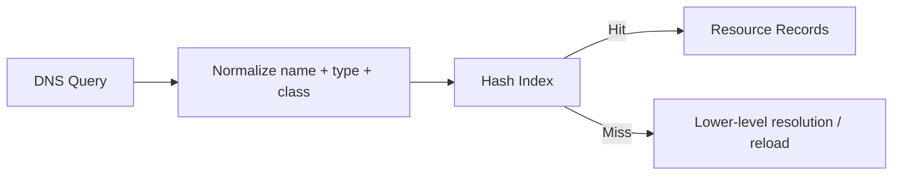
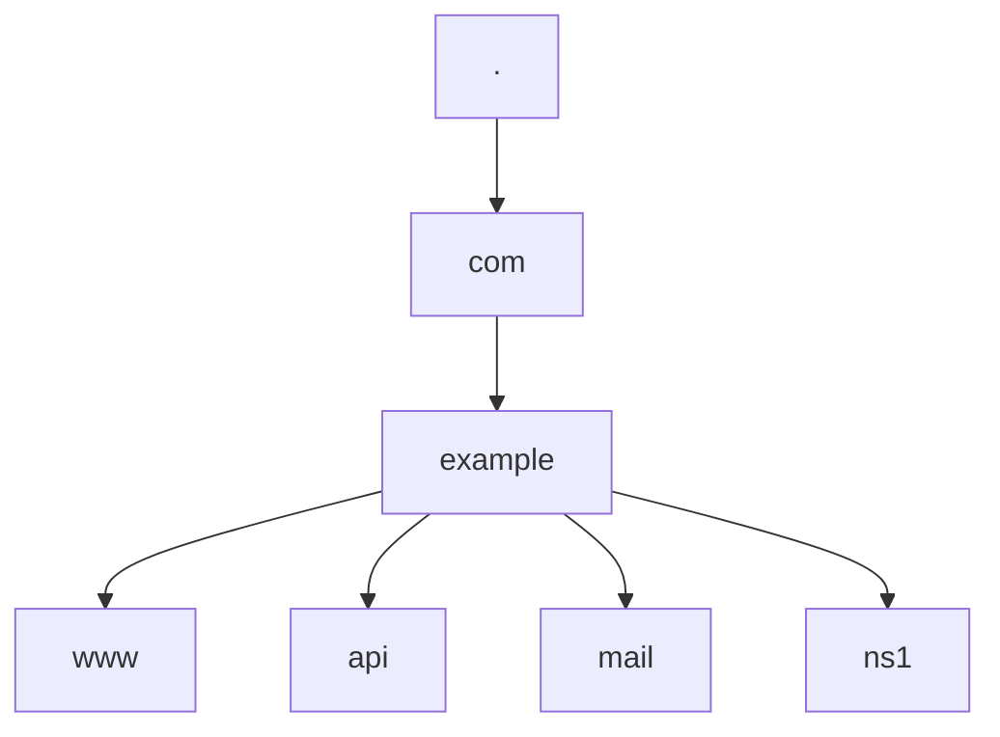
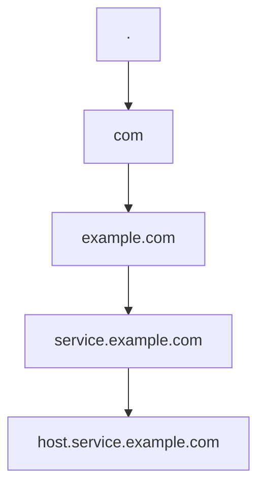
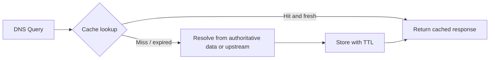
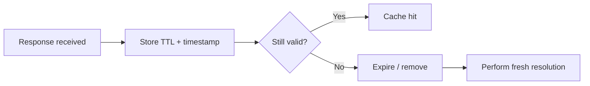
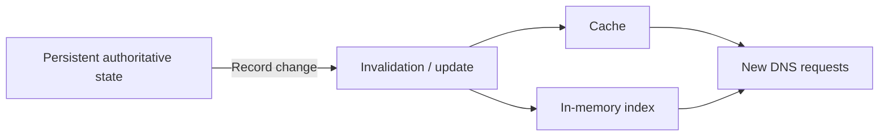
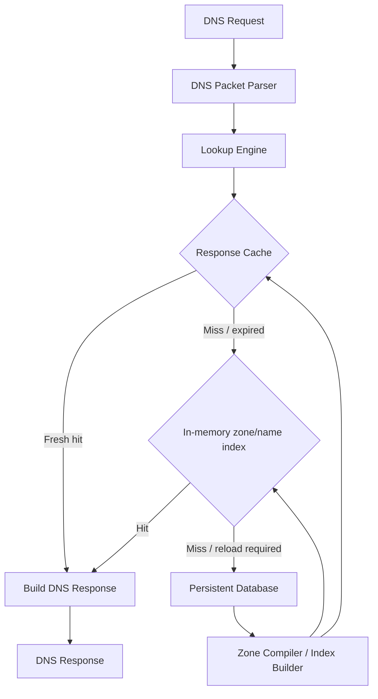
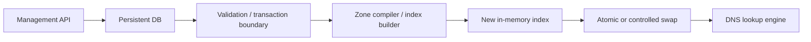
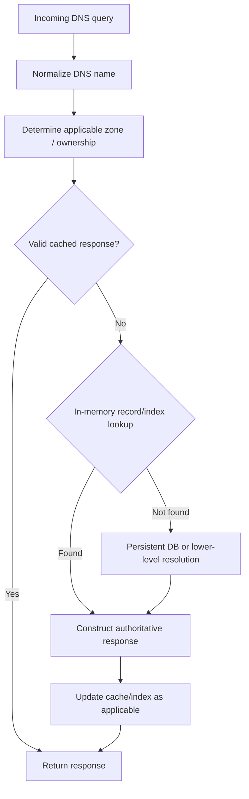
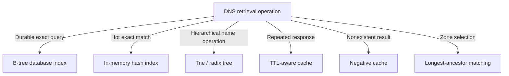

# DNS Data Retrieval and Lookup Architecture

Branch: `production-readiness`

## Purpose

This note defines the DNS-specific data retrieval methods and data structures that should be considered for MyDNS production readiness. DNS lookup is a high-volume, latency-sensitive operation, so the persistent database should not automatically become the per-request lookup path.

The key principle is to separate **durable state** from the **optimized DNS read path**.

---

## 1. DNS lookup as a data-retrieval problem

At its simplest, an authoritative DNS lookup maps a normalized DNS name and record attributes to one or more resource records:

```text
(normalized FQDN, record type, class)
                ↓
         Resource Records
```

For example:

```text
www.example.com. + A + IN
                ↓
        192.0.2.10
```

A production DNS server should avoid full-table scans and avoid making a synchronous relational-database query for every DNS request.

---

## 2. Exact-match lookup - B-tree indexes

A relational database such as MyDNS's persistent SQLite layer can efficiently support exact record retrieval using a **B-tree index**.

Conceptually:

```sql
CREATE INDEX idx_dns_name
ON records(name);
```

A lookup then becomes an indexed query rather than a full-table scan:

```sql
SELECT *
FROM records
WHERE name = 'www.example.com.';
```

### Characteristics

- Typical indexed lookup complexity: `O(log n)`.
- Good fit for durable persistent storage.
- Supports exact-name queries efficiently.
- Composite indexes can include record type/class where query patterns justify them.
- Requires correct DNS-name normalization.
- Should not be the normal hot path for every incoming DNS request.

For MyDNS, the database should primarily provide **durability and authoritative state**, with an optimized representation used by the DNS serving path.

---

## 3. In-memory hash lookup

DNS queries are frequently exact-match operations, which makes an in-memory hash table a strong candidate for the hot path.



A logical cache/index key can be:

```text
(normalized_name, record_type, record_class)
```

For example:

```text
("www.example.com.", A, IN)
```

maps directly to the corresponding records.

### Characteristics

- Average exact-match lookup is approximately `O(1)`.
- Extremely suitable for high-frequency reads.
- Avoids database I/O on cache/index hits.
- Requires memory management and synchronization for concurrent access.
- Must have a defined rebuild/reload strategy when persistent data changes.

A hash index is therefore particularly useful for **exact authoritative record retrieval** and for cache entries.

---

## 4. Trie and radix-tree lookup

DNS names are hierarchical rather than flat strings. A trie or compressed radix tree can represent that hierarchy explicitly.

For example:



A compressed radix tree reduces redundant path nodes compared with a basic character/label trie.

### Why this matters for DNS

A hierarchical structure is useful when the lookup operation involves more than an exact record match, including:

- Finding the closest enclosing zone.
- Selecting the authoritative zone.
- Finding delegation boundaries.
- Processing wildcard candidates.
- Walking DNS label ancestry.
- Supporting hierarchical reload/index operations.

The implementation should normally operate on **DNS labels**, not arbitrary string prefixes.

---

## 5. Hierarchical / longest-ancestor matching

Consider a query:

```text
host.service.example.com.
```

There may not be an exact record for the complete name. The DNS engine may first need to determine which configured/authoritative zone is applicable.

Conceptually:



If `example.com.` is an authoritative zone, the engine can identify it as the closest applicable ancestor when handling names below it.

This is conceptually similar to **longest-prefix matching** in IP routing, but DNS uses hierarchical labels rather than binary IP prefixes.

### Important correctness rule

Do **not** implement this as arbitrary string-prefix matching.

For example, these names are not equivalent DNS ancestry relationships:

```text
example.com.
notexample.com.
```

The implementation must preserve DNS label boundaries and canonicalization rules.

---

## 6. Positive caching

Caching is a first-class retrieval mechanism in DNS, not merely an optional performance optimization.

If the same record is requested repeatedly, the server should avoid repeatedly traversing the lower-level resolution path.



A cache entry should contain enough information to determine whether it remains usable, including an expiration derived from the record's TTL.

A practical logical key is generally:

```text
(name, type, class)
```

Depending on the resolver design, additional context may be required.

---

## 7. Negative caching

DNS can also cache the absence of data.

Two important cases must not be confused:

### NXDOMAIN

The queried DNS name does not exist.

```text
no-such-name.example.com.
        ↓
     NXDOMAIN
```

### NODATA

The name exists, but there is no record of the requested type.

```text
www.example.com. + AAAA
        ↓
       NODATA
```

These outcomes have different DNS semantics and should be represented distinctly in the implementation.

Negative caching reduces repeated work for clients repeatedly requesting nonexistent names or unsupported record types.

---

## 8. TTL and cache expiration

TTL determines how long cached DNS information can remain valid.

The cache therefore needs an expiration model:



The authoritative/backend expiration mechanism is the source of truth. Any UI countdown is presentation only and must not redefine server-side expiration.

Production implementation should also account for:

- Expired-entry pruning.
- Lazy expiration on access.
- Background cleanup where appropriate.
- Clock/timestamp consistency.
- Concurrent access during expiration.
- Cache invalidation when authoritative records change.

---

## 9. Cache invalidation

If authoritative data changes, cached data derived from the old state can become stale.

For example:

```text
www.example.com. A → 192.0.2.10
```

changes to:

```text
www.example.com. A → 192.0.2.20
```

The implementation must define how the relevant cached/indexed representation is updated or invalidated.



The important requirement is that a successful management update must not leave the DNS serving path indefinitely returning an obsolete representation.

---

## 10. Zone database vs resolver cache

The retrieval model depends on whether MyDNS is acting as an authoritative server, recursive resolver, or both.

### Authoritative DNS

The durable model is primarily zone and record state:

```text
Zones
  ├── example.com.
  ├── example.org.
  └── example.net.

Records
  ├── www.example.com. A 192.0.2.10
  ├── mail.example.com. MX ...
  └── api.example.com. A 192.0.2.20
```

The hot path should be optimized for:

- Zone ownership.
- Exact record retrieval.
- Record-type handling.
- DNS response construction.

### Recursive resolver

The dominant durable-in-memory model is learned/cached DNS information:

```text
google.com. A
example.com. NS
example.org. AAAA
```

A recursive resolver additionally needs mechanisms for:

- Cache freshness.
- Positive and negative caching.
- Upstream/server selection.
- Timeouts and retries.
- Iterative/recursive resolution.
- Delegation traversal.

These requirements can change which data structures are most useful.

---

## 11. Recommended MyDNS retrieval architecture

The recommended model is to keep the persistent database as the **source of truth**, while loading/building optimized in-memory structures for the DNS read path.



This separates responsibilities:

| Layer | Primary responsibility | Typical structure |
|---|---|---|
| Persistent DB | Durable authoritative state | Relational tables + B-tree indexes |
| Zone/name index | Fast authoritative lookup | Hash table and/or trie/radix tree |
| Response cache | Repeated response retrieval | TTL-aware hash map/cache |
| Lookup engine | DNS-specific resolution logic | Hierarchical lookup + resolution rules |
| DNS protocol layer | Packet parsing/response construction | DNS message structures |

The exact implementation can use one or more structures. The important production requirement is that **the database must not automatically be on the synchronous hot path for every DNS request**.

---

## 12. Database-to-index synchronization

If the database is the source of truth and memory is the read-optimized representation, MyDNS needs a well-defined synchronization model.

A typical model is:



The implementation should define whether updates are:

- Incremental.
- Full-zone reloads.
- Snapshot-based.
- Atomically swapped.
- Versioned.

For production readiness, concurrent DNS requests must see a coherent state during reloads rather than a partially rebuilt index.

---

## 13. Retrieval decision flow

A useful conceptual lookup sequence for MyDNS is:



The actual order can differ depending on authoritative versus recursive behavior. For example, an authoritative server may not need an upstream step, while a recursive resolver may fall through to upstream/iterative resolution after a cache miss.

---

## 14. Production-readiness requirements

Before V1.0.0, the lookup layer should be evaluated for:

### Correctness

- Exact lookup correctness.
- Case-insensitive DNS-name normalization.
- Trailing-dot normalization.
- DNS label-boundary correctness.
- Zone/ancestor selection.
- Record-type separation.
- Record-class separation.
- NXDOMAIN versus NODATA semantics.
- Wildcard/delegation behavior where supported.

### Performance

- No full-table scans on the DNS hot path.
- No unnecessary synchronous database access on cache/index hits.
- Lookup latency under concurrent load.
- Bounded memory usage.
- Bounded per-request allocations.
- Efficient cache expiration/pruning.

### Concurrency and consistency

- Safe concurrent cache access.
- Safe concurrent index access.
- Database-to-index synchronization.
- Coherent index reloads.
- Cache invalidation after record changes.
- Deterministic startup loading.
- Deterministic shutdown behavior.

### Failure handling

- Safe behavior when the database is unavailable.
- Safe behavior when index loading fails.
- Defined cache behavior during persistence failures.
- No partially published index state.
- No stale state surviving indefinitely without a defined policy.

### Verification

Measure rather than assume performance. At minimum, test:

- Exact lookup throughput.
- Cache-hit latency.
- Cache-miss latency.
- Database-backed lookup latency.
- Large-zone loading time.
- Index rebuild time.
- Concurrent reads during reload.
- Cache pressure and eviction/pruning.
- Memory growth under sustained query load.

---

## 15. Design principle

MyDNS should use each mechanism for the operation it is good at:



The database provides **durability and authoritative state**. In-memory indexes provide **fast structural lookup**. Caches provide **reuse of recent answers**. DNS-specific hierarchical algorithms provide **correct zone and name resolution**.

The final implementation should select the minimum set of structures that provides the required correctness and performance rather than adding data structures merely because they are theoretically faster.